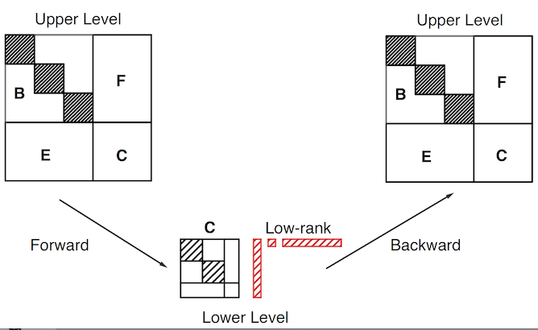

**ParGeMSLR: A MPI based parallel hierarchical low-rank preconditioner (Version 1.0.0)**

**ParGeMSLR** (Parallel Generalized Multilevel Schur Low-Rank) is a MPI-based C++ library. \n 
This is a distributed-memory Multilevel Low-Rank Preconditioning and Solution package for the solution of large and sparse (non)symmetric linear systems of equations. \n
The Parallel GeMSLR preconditioner is purely algebraic and is based on a multilevel reordering of the original set of equations/variables. 
The reordering is implemented by hierarchically ordering the interface degrees of freedom at each level and several reordering schemes are available. 
At each given level, GeMSLR decouples (via ParMETIS) the solution of the current linear system into one associated with the interior variables and another associated with the interface ones.
The first subproblem is block-diagonal and solved in parallel by applying some form of ILU preconditioning. 
The recursive nature of the preconditioner appears on the second subproblem where the Schur complement linear system is reconditioned by the interface coupling matrix. 
The latter is applied by descending to the next level until the last level is reached. 
In the latter case, the user can choose to use either Block Jacobi acceleration or redundantly solve the problem by (I)LU. 
Low-rank correction terms can be added at each level to further enhance robustness, and these are applied using the Woodbury formula.

For questions/feedback send e-mail to Yousef Saad [saad@umn.edu] or Tianshi Xu [xuxx1180@umn.edu].

**DESCRIPTION OF CONTENTS**

 * INC
   - pargemslr.hpp                     : Global header for ParGeMSLR.

 * SRC
   - utils                             : Utility functions.
      - complex.hpp                    : Complex value for ParGeMSLR.
      - utils.hpp                      : Basic utility functions.
      - parallel.hpp                   : Basic parallel functions.
      - memory.hpp                     : Memory management.
      - protos.hpp                     : Functions from external packages.
      - mmio.hpp                       : Matrix Market helper functions.
   - vectors                           : Vector functions.
      - vector.hpp                     : Virtual vector classes.
      - int_vector.hpp                 : Integer vector.
      - sequential_vector.hpp          : Sequential real/complex vector.
      - parallel_vector.hpp            : Parallel real/complex vector.
      - vectorops.hpp                  : Vector operations.
   - matrices                          : Matrix functions.
      - matrix.hpp                     : Virtual matrix classes.
      - coo_matrix.hpp                 : COO matrix class.
      - csr_matrix.hpp                 : CSR matrix class.
      - dense_matrix.hpp               : Dense matrix class.
      - parallel_csr_matrix.hpp        : Parallel CSR matrix class.
      - matrixops.hpp                  : Matrix operations.
   - solvers                           : Solvers.
      - solver.hpp                     : Virtual solver classes.
      - fgmres.hpp                     : FlexGMRES solver.
   - preconditioners                   : Preconditioenrs.
      - ilu.hpp                        : Incomplete LU factorization preconditioners.
      - gemslr.hpp                     : Sequential GeMSLR preconditioner.
      - block_jacobi.hpp               : Block Jacobi preconditioners.
      - parallel_gemslr.hpp            : Parallel GeMSLR preconditioenr.

 * TESTS
   - driver_laplacian_gemslr_seq.cpp   : driver for parallel real GeMSLR laplacian tests.
   - driver_laplacian_gemslr_par.cpp   : driver for parallel real GeMSLR laplacian tests.
   - driver_laplacian_gemslrz_seq.cpp  : driver for parallel complex GeMSLR laplacian tests.
   - driver_laplacian_gemslrz_par.cpp  : driver for parallel complex GeMSLR laplacian tests.
   - driver_gen_gemslr_seq.cpp         : driver for parallel real GeMSLR general matrix tests.
   - driver_gen_gemslr_par.cpp         : driver for parallel real GeMSLR general matrix tests.
   - driver_gen_gemslrz_seq.cpp        : driver for parallel complex GeMSLR general matrix tests.
   - driver_gen_gemslrz_par.cpp        : driver for parallel complex GeMSLR general matrix tests.

**INSTALLATION**

 * Package
   1. Edit makefile.in. Set the path of BLAS, LAPACK, and ParMETIS (please use INT_64 and DOUBLE for ParMETIS by changing IDXTYPEWIDTH and REALTYPEWIDTH in parmetis/metis/include/metis.h from 32 to 64). Change compile options.
   2. Make the library with make command.
   
 * Tests
   1. Make the library.
   2. For sequential tests, go to folder TESTS/sequential.
   3. For parallel tests, go to folder TESTS/parallel.
   3. Make those tests with make command.

**SAMPLE RUNS**

 * Sequential version (Our current sequential version requires mpirun)
 
   - mpirun -np 1 ./driver_gen_gemslr_seq.ex
      - Solve general real matrix with GeMSLR.
      - Read solver/preconditioner settings from file "inputs".
      - Load matrix from file "matfile_real".
   
   - mpirun -np 1 ./driver_gen_gemslrz_seq.ex
      - Solve general complex matrix with GeMSLR.
      - Read solver/preconditioner settings from file "inputs".
      - Load matrix from file "matfile_complex".
      
   - mpirun -np 1 ./driver_laplacian_gemslr_seq.ex -fromfile inputs_user
      - Solve real Laplacian matrix with GeMSLR.
      - Read solver/preconditioner settings from file "inputs_user".
      - Load matrix from file "lapfile_real".
   
   - mpirun -np 1 ./driver_laplacian_gemslrz_seq.ex -fromfile inputs_user -outfile out.log
      - Solve compplex Laplacian matrix with GeMSLR.
      - Read solver/preconditioner settings from file "inputs_user", write output to "out.log"
      - Load matrix from file "lapfile_complex".
   
 * Parallel version
   
   - mpirun -np 2 ./driver_gen_gemslr_par.ex
      - Solve general real matrix with GeMSLR.
      - Read solver/preconditioner settings from file "inputs".
      - Load matrix from file "matfile_real".
   
   - mpirun -np 2 ./driver_gen_gemslrz_par.ex
      - Solve general complex matrix with GeMSLR.
      - Read solver/preconditioner settings from file "inputs".
      - Load matrix from file "matfile_complex".
      
   - mpirun -np 2 ./driver_laplacian_gemslr_par.ex -fromfile inputs_user
      - Solve real Laplacian matrix with GeMSLR.
      - Read solver/preconditioner settings from file "inputs_user".
      - Load matrix from file "lapfile_real".
   
   - mpirun -np 2 ./driver_laplacian_gemslrz_par.ex -fromfile -outfile out.log
      - Solve compplex Laplacian matrix with GeMSLR.
      - Read solver/preconditioner settings from file "inputs", write output to "out.log"
      - Load matrix from file "lapfile_complex".
